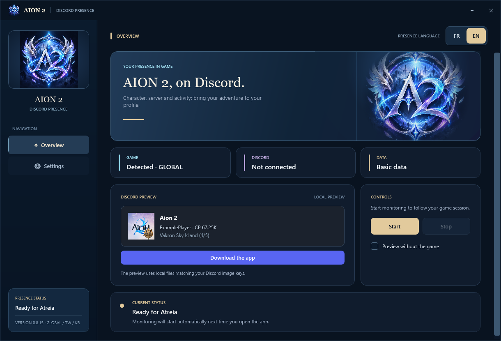
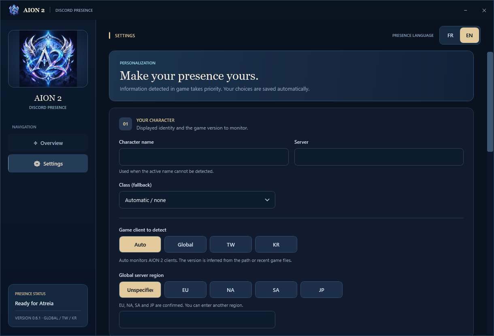
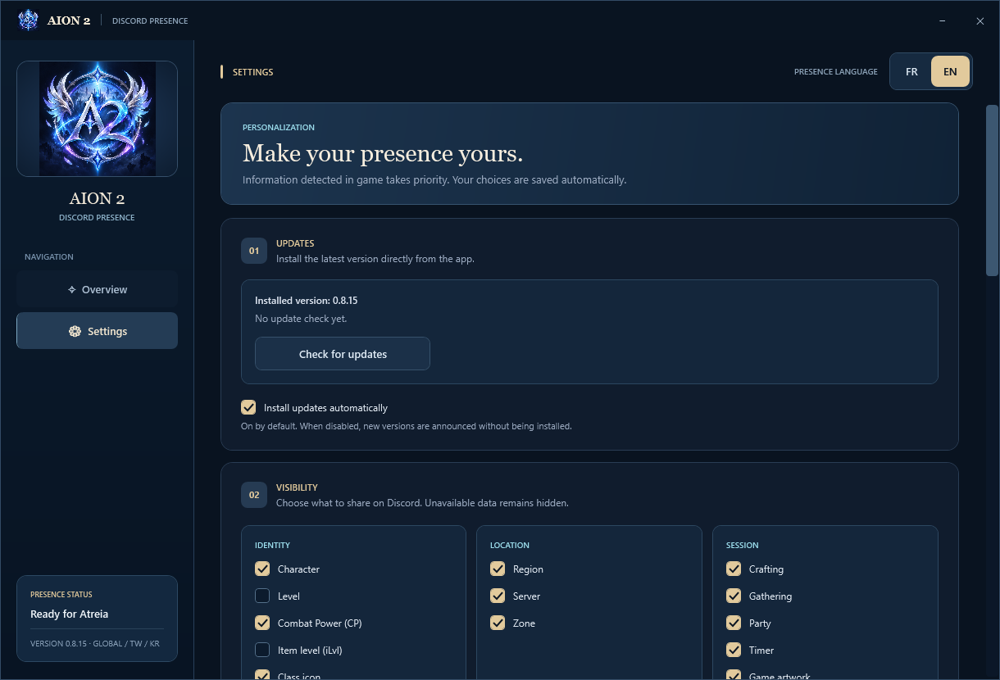
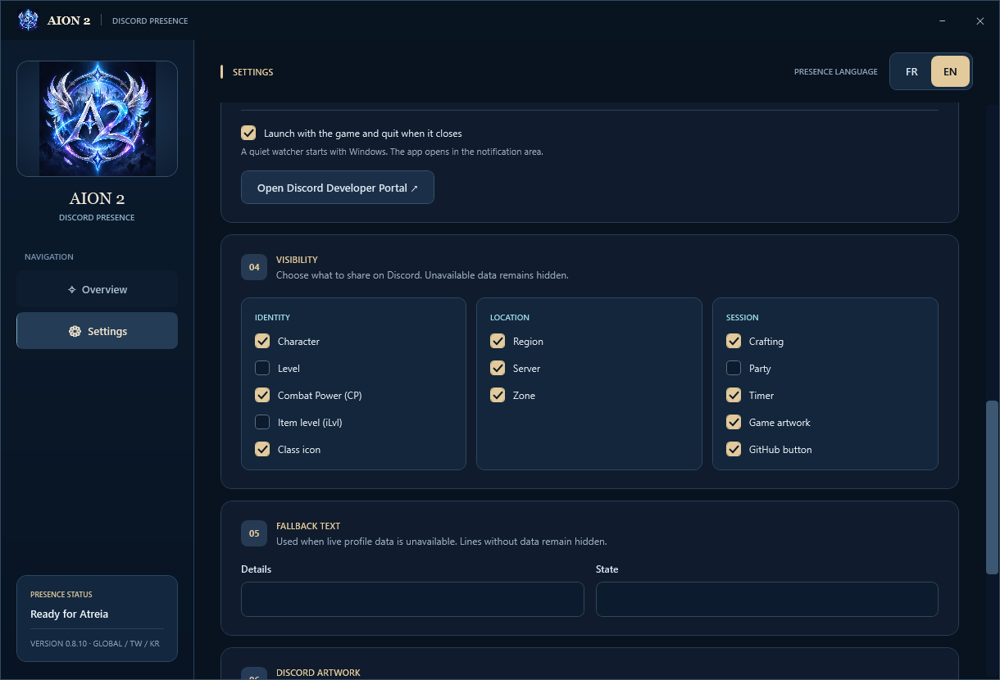
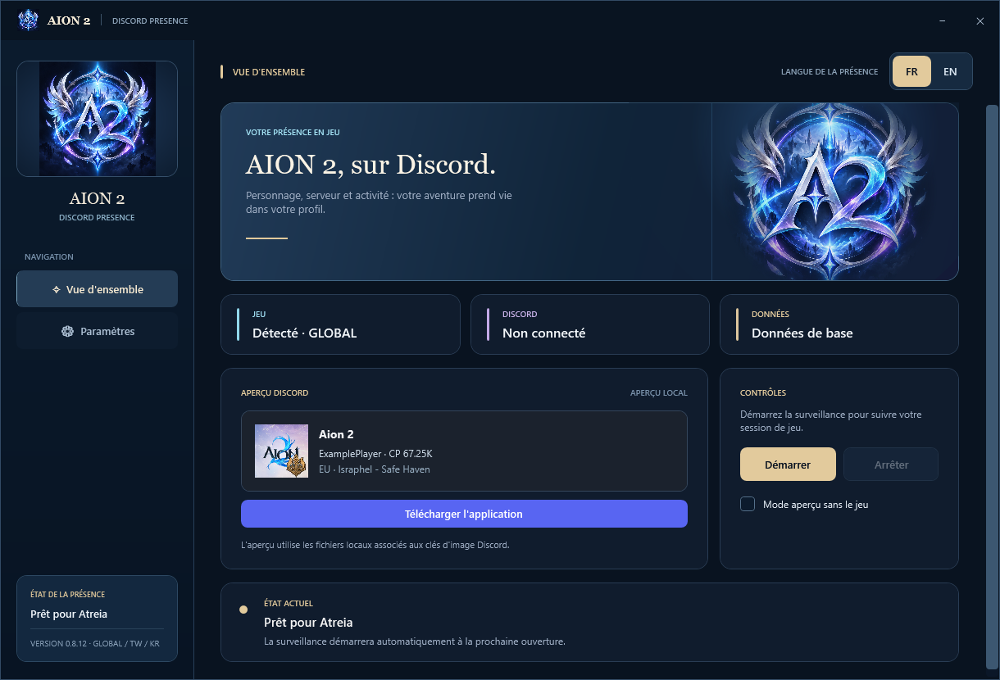
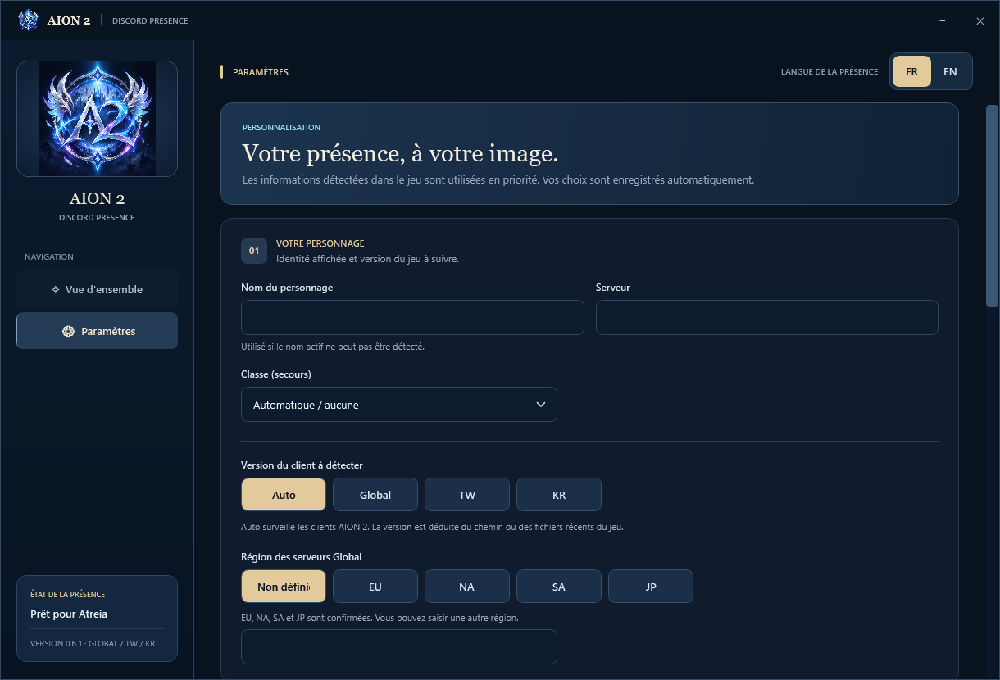
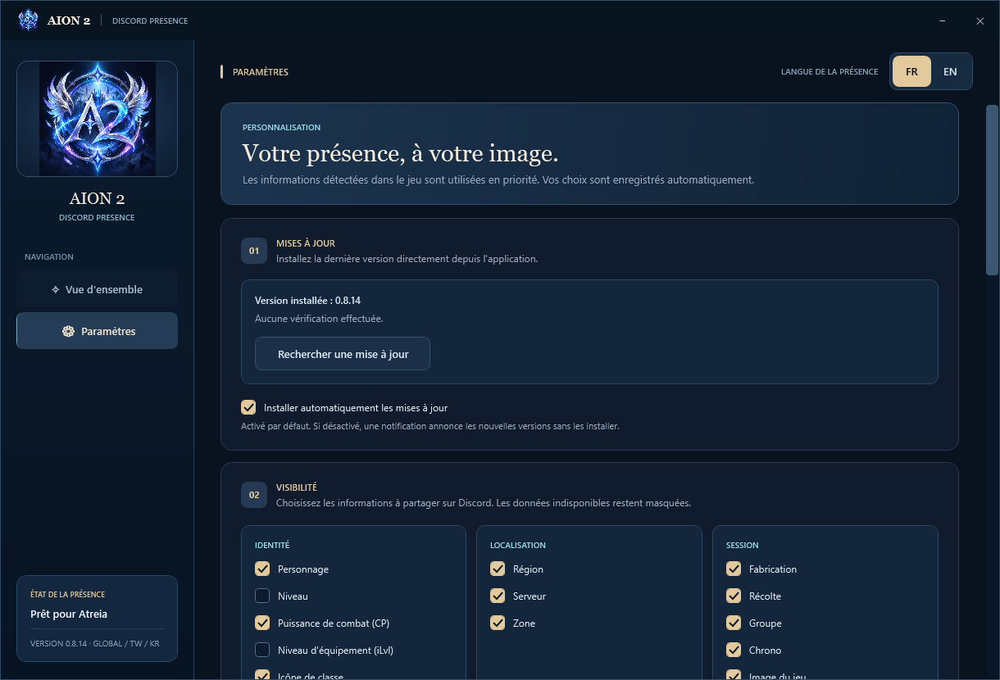
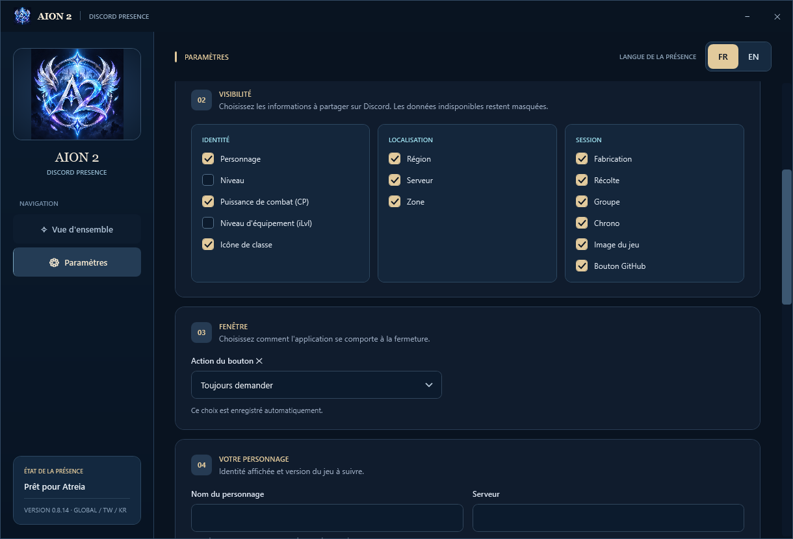

# AION 2 Discord Rich Presence for Windows 10/11

**English** · [Français](#français)

Show your **AION 2** character and game session on Discord. AION 2 Discord Presence starts in the notification area with the game, uses the game session timer, and exits when the game closes.

[Download the installer](https://github.com/KaiiZzeR971/AION-2-Discord-Rich-Presence/releases/latest) · [Requirements](#requirements) · [Compatibility](#compatibility-and-detection) · [Troubleshooting](#troubleshooting)

## Requirements

| Requirement | When it is needed |
| --- | --- |
| Windows 10 or Windows 11 | To install and run the application. |
| Discord desktop app, signed in | To display the Rich Presence. |
| AION 2 running with a character connected | To receive game session data. |
| [Npcap](https://npcap.com/#download), installed separately | For automatic character data detection on Global. It is not included in our installer. |
| Internet access | For downloads, updates, and the public NCSOFT server-name lookup. The location catalog is included in the app. |

A Discord developer account is not required. The shared Application ID and game/class artwork are already configured. PowerShell 7 is not required, and no PowerShell terminal opens when the app starts.

## Download and first setup

1. Download [AionPresence-Setup-0.8.5.exe](https://github.com/KaiiZzeR971/AION-2-Discord-Rich-Presence/releases/download/v0.8.5/AionPresence-Setup-0.8.5.exe) from this repository's Releases.
2. Run the installer. Installation is required. The app is installed for your Windows account and added to the Start menu.
3. For Global automatic detection, complete the [Npcap setup](#npcap-setup-for-global) below before starting the game.
4. Open **AION 2 Discord Presence** from the Start menu once. Select **EN** or **FR**, leave the client selection on **Auto**, and choose which fields to display in Settings.
5. Keep Discord desktop open, then start AION 2 and connect to your character. Automatic launch with the game is enabled by default after the first app launch.
6. If you installed the app while already in game, a new character login or a teleport may be needed before the game sends the first character and location data. No name or server entry is required when automatic detection succeeds.

After setup, the app launches quietly near the Windows clock when the game starts. You can open its window from the notification icon. Preferences are saved automatically. Unavailable data and disabled fields are omitted from the presence.

The installer is currently **unsigned**, so Windows may display a warning. A [SHA-256 checksum](https://github.com/KaiiZzeR971/AION-2-Discord-Rich-Presence/releases/download/v0.8.5/AionPresence-Setup-0.8.5.sha256) is provided alongside the installer.

## Npcap setup for Global

Download Npcap from its [official download page](https://npcap.com/#download) and run its installer. Windows may request permission to install the driver. Use these settings:

| Npcap installer option | Selection for AION 2 Discord Presence |
| --- | --- |
| **WinPcap API-compatible Mode** | Enabled |
| **Restrict Npcap driver's access to Administrators only** | Disabled |

The options are documented in the [official Npcap installation guide](https://npcap.com/guide/npcap-users-guide.html). Finish installation and restart Windows if requested. Then **quit the presence app completely from its notification icon and reopen it**. Closing the window may only minimize it, depending on your saved preference.

Npcap is a separate prerequisite for Global detection. Without it, the app can still display the game timer, artwork, and available saved fallback fields. TW window-title name detection does not require Npcap. The full Global data detector has not been validated on TW or KR.

## Compatibility and detection

| Client or region | Current status |
| --- | --- |
| Global Steam, EU | Character, class, level, gear score, server, region, scene location, and five-player Party Finder membership tested on an EU session. |
| Global NA East, NA West, South America, Asia | Region handling is implemented. Live detection has not yet been verified in each service region or on every server. |
| Taiwan (TW) | Game detection and character name from the window title tested. Full Global network data detection is not validated on TW. |
| Korea (KR) | Game/client detection is supported. Automatic character fields have not been validated in a KR session. |
| Other launchers or installation layouts | Client detection depends on the executable path and recent game files. Select the client manually in Settings if Auto cannot identify it. |

### What updates automatically on Global

- **Character name and class:** read from the active game session when its identity message arrives. With the app running before entering the game, capture is prepared before the Global connection so the login messages can initialize the presence. If the app starts after login without a same-session cache, it still needs a fresh identity message.
- **Character level and item level (`iLvl`):** read from game session messages. These fields update when the game sends new values.
- **Combat Power (`CP`):** read from your own Global character or group messages. Enabled by default; item level is disabled by default and can be enabled independently in Settings. Missing values remain hidden. The last received CP is kept across app restarts within the same game session.
- **CP formatting:** game-style compact values such as `CP 67.25K` and `CP 1.23M`, with the complete number retained internally.
- **Server region:** derived from the server ID. The **server name** is looked up through [NCSOFT's public character search](https://aion2.plaync.com/) using the character name, server ID, and region. Lookup depends on the public service and is refreshed at most every five minutes.
- **Location after loading:** an offline catalog associates **553 destination IDs across 93 maps** with the client's English and French names. The app checks that the destination belongs to the reported map.
- **Dungeon location:** a second catalog covers **82 dungeon map variants**, with English and French names. Instanced scene messages are supported, including Vakron Sky Island.
- **Party membership:** the app reads your own Party Finder room's roster and member updates. It displays the count and capacity, distinguishes the recruitment lobby from the dungeon group, and clears the count when you leave. Initial support for normal parties outside the Party Finder is also included, with a solo normal party tested on Global Steam EU. The **Party** visibility option controls this field.
- **Party display:** Party or Lobby and the native member counter occupy their own presence line. Character and location information share the preceding line while grouped. The timer remains separate.
- **Region and server:** compact format such as `EU · Israphel - Safe Haven`. The zone shows only its name and uses a hyphen separator. It appears below character information outside a group, or alongside character information when the group occupies its own line. Empty or hidden fields leave no separator behind.
- **Session timer:** based on the game process start time. Reopening the presence app while the same game session is running preserves the timer.

Character identity and the last detected location are kept when the presence app restarts during the same game session. A new game session does not reuse an old location.

### Current limitations

- Location detection follows the game's scene messages. The displayed place is the **last detected loaded destination**. Continuous updates while walking between areas are not yet verified.
- A destination missing from the catalog shows a recognized map name. If the map is also unknown, the location stays hidden.
- Party detection has been tested with a five-player Party Finder group and the creation/departure of a solo normal party on Global Steam EU. Normal parties with several players, additional member formats, raids, TW/KR, and other regions still require validation. After reopening the app, the count stays hidden until a recognized fresh roster is received. Changes depend on membership messages sent by the game.
- The catalog contains client data, but every destination has not been tested in a live session. The complete Global feature set is not yet verified across all clients, servers, and regions.

## Features and settings

Default visibility: character, CP, class icon, region, server, zone, timer, game artwork and GitHub button enabled. Character level, item level and party disabled. Each option can be changed in Settings; updates preserve saved preferences.

- French or English interface and presence, including localized Global destination names.
- Visibility controls for character, level, gear score, class icon, region, server, location, party, timer, artwork, and download button.
- Game image and class icons, including Brawler.
- Automatic launch in the notification area with `Aion2.exe`, and exit when the game closes.
- Saved preferences and a configurable close button: ask, minimize to notification area, or quit.
- A Discord button linking to this project's latest release. Enabled by default and configurable in **Settings → Visibility**.
- In-app updates under **Settings → Updates**. Automatic installation is **off by default**. When enabled, update checks run at most every six hours. Downloads are checked against GitHub's SHA-256 digest.
- Local Discord preview and manual fallback fields.

## Troubleshooting

| Problem | What to check |
| --- | --- |
| Global automatic detection says Npcap is missing | Install Npcap with the settings above, quit the presence app from its notification icon, and reopen it. |
| Capture is unavailable | Check Npcap's compatibility and access settings. If you previously selected administrator-only access, reinstall Npcap with that option off, then reopen the app. Follow any reboot request from Npcap. |
| The character or location is still empty | Keep the presence app running, log in to your character or teleport once, and wait for the app to refresh. Check the client selection in Settings. |
| The game is detected but the client is unknown | Select Global, TW, or KR manually in Settings, according to the installed game version. |
| The server name is empty | The public NCSOFT lookup may be unavailable or may not return the character. A saved server field can be used as a fallback. |
| The location does not change while walking | This behavior is not yet validated. The app currently follows scene messages and keeps the last detected loaded destination. |
| The party does not appear | Enable Party in the visibility settings and keep the app running before creating or joining a group. A recognized fresh roster is needed after reopening the app. Normal-party support is currently limited to validated message formats. |
| There is no presence on Discord | Keep Discord desktop open and signed in, verify that activity sharing is enabled in Discord, and make sure monitoring is running in the presence app. |
| The window closes but the app remains running | Your close-button preference may minimize it. Use the notification icon's Quit action for a full exit. |

If a problem continues, open an [issue](https://github.com/KaiiZzeR971/AION-2-Discord-Rich-Presence/issues) with the app version, Windows version, game client/region, and the message shown in the app. Screenshots can help; hide personal information before attaching them.

## Screenshots

## FAQ

**Do I need to create a Discord application?** No. The shared Application ID is included. You can enter your own ID in Settings if you prefer.

**Why can't I see the GitHub button on my own Discord presence?** [Discord shows Rich Presence buttons only to other users](https://docs.discord.com/developers/discord-social-sdk/development-guides/setting-rich-presence#setting-buttons). Ask a friend or use a second account to view your profile and check the button.

**How do updates work?** Check and install from Settings → Updates. Automatic updates are optional and disabled by default. The app briefly closes while the installer replaces it, then restarts. Preferences are preserved, and old downloaded update installers are cleaned up.

**How do I uninstall it?** Use **Windows Settings → Installed apps → AION 2 Discord Presence**. Npcap is installed separately and is managed separately in Windows.

---

## Français

Affichez votre personnage et votre session **AION 2** sur Discord. AION 2 Discord Presence démarre dans la zone de notification avec le jeu, utilise son chrono de session et se ferme quand vous quittez le jeu.

[Télécharger l'installateur](https://github.com/KaiiZzeR971/AION-2-Discord-Rich-Presence/releases/latest) · [Prérequis](#prérequis) · [Compatibilité](#compatibilité-et-détection) · [Dépannage](#dépannage)

### Prérequis

| Prérequis | Utilisation |
| --- | --- |
| Windows 10 ou Windows 11 | Installer et exécuter l'application. |
| Application Discord de bureau, avec un compte connecté | Afficher la Rich Presence. |
| AION 2 lancé avec un personnage connecté | Recevoir les données de la session de jeu. |
| [Npcap](https://npcap.com/#download), installé séparément | Détection automatique des données du personnage sur Global. Il n'est pas inclus dans notre installateur. |
| Connexion Internet | Téléchargements, mises à jour et recherche publique du nom du serveur chez NCSOFT. Le catalogue des lieux est intégré à l'application. |

Aucun compte développeur Discord n'est nécessaire. L'Application ID partagé et les images du jeu et des classes sont déjà configurés. PowerShell 7 n'est pas requis et aucun terminal PowerShell ne s'ouvre au lancement.

### Télécharger et configurer

1. Téléchargez [AionPresence-Setup-0.8.5.exe](https://github.com/KaiiZzeR971/AION-2-Discord-Rich-Presence/releases/download/v0.8.5/AionPresence-Setup-0.8.5.exe) depuis les Releases de ce dépôt.
2. Lancez l'installateur. L'installation est obligatoire. L'application est installée pour votre compte Windows et ajoutée au menu Démarrer.
3. Pour la détection automatique sur Global, effectuez la [configuration Npcap](#configuration-de-npcap-pour-global) ci-dessous avant de lancer le jeu.
4. Ouvrez une première fois **AION 2 Discord Presence** depuis le menu Démarrer. Choisissez **FR** ou **EN**, laissez la version du client sur **Auto** et choisissez les champs à afficher dans les paramètres.
5. Gardez Discord de bureau ouvert, puis lancez AION 2 et connectez votre personnage. Le lancement automatique avec le jeu est activé par défaut après la première ouverture de l'application.
6. Si le jeu était déjà ouvert pendant l'installation, une nouvelle connexion au personnage ou une téléportation peut être nécessaire pour recevoir les premières données du personnage et du lieu. Aucun nom de personnage ou de serveur n'est à saisir lorsque la détection automatique fonctionne.

Après cette configuration, l'application démarre discrètement près de l'horloge Windows avec le jeu. Son icône de notification permet de rouvrir la fenêtre. Les préférences sont sauvegardées automatiquement. Les champs indisponibles ou désactivés sont omis de la présence.

L'installateur est actuellement **non signé** ; Windows peut afficher un avertissement. Une [somme SHA-256](https://github.com/KaiiZzeR971/AION-2-Discord-Rich-Presence/releases/download/v0.8.5/AionPresence-Setup-0.8.5.sha256) accompagne l'installateur.

### Configuration de Npcap pour Global

Téléchargez Npcap depuis sa [page officielle](https://npcap.com/#download), puis lancez son installateur. Windows peut demander l'autorisation d'installer le pilote. Utilisez ces réglages :

| Option de l'installateur Npcap | Choix pour AION 2 Discord Presence |
| --- | --- |
| **WinPcap API-compatible Mode** | Activée |
| **Restrict Npcap driver's access to Administrators only** | Désactivée |

Les options sont décrites dans le [guide officiel de Npcap](https://npcap.com/guide/npcap-users-guide.html). Terminez l'installation et redémarrez Windows si cela vous est demandé. Ensuite, **quittez complètement l'application de présence depuis son icône près de l'horloge, puis relancez-la**. Fermer sa fenêtre peut seulement la réduire, selon votre préférence enregistrée.

Npcap est un prérequis séparé pour la détection Global. Sans lui, l'application peut afficher le chrono, les images et les champs de secours enregistrés disponibles. La lecture du nom dans le titre de fenêtre TW ne nécessite pas Npcap. La détection complète des données Global n'a pas été validée sur TW ou KR.

### Compatibilité et détection

| Client ou région | État actuel |
| --- | --- |
| Global Steam, EU | Lecture du personnage, de la classe, du niveau, du score d'équipement, du serveur, de la région, du lieu et des membres d'un groupe de cinq joueurs du Party Finder testée sur une session EU. |
| Global NA Est, NA Ouest, Amérique du Sud, Asie | Gestion des régions intégrée. La détection réelle n'a pas encore été vérifiée dans chaque région de service ou sur chaque serveur. |
| Taïwan (TW) | Détection du jeu et lecture du nom dans le titre de fenêtre testées. La détection réseau complète de Global n'est pas validée sur TW. |
| Corée (KR) | Détection du jeu et du client prise en charge. Les champs automatiques du personnage n'ont pas été validés dans une session KR. |
| Autres lanceurs ou emplacements d'installation | La détection du client dépend du chemin du jeu et de ses fichiers récents. Choisissez le client manuellement dans les paramètres si Auto ne l'identifie pas. |

### Données automatiques sur Global

- **Nom du personnage et classe :** lus dans la session active lorsque le jeu transmet son message d'identité. Si l'application tourne avant l'entrée en jeu, la capture est préparée avant la connexion Global pour recevoir les informations initiales. Si elle démarre après la connexion sans cache de la même session, elle doit encore recevoir un nouveau message d'identité.
- **Niveau du personnage et niveau d'équipement (`iLvl`) :** lus dans les messages du jeu. Ces champs s'actualisent lorsque le jeu transmet de nouvelles valeurs.
- **Puissance de combat (`CP`) :** lue dans les messages de votre propre personnage ou groupe sur Global. Activée par défaut ; l'iLvl est désactivé par défaut et peut être activé indépendamment dans les paramètres. Les valeurs indisponibles restent masquées. Le dernier CP reçu est conservé lors d'un redémarrage de l'application pendant la même session de jeu.
- **Format du CP :** valeurs compactes comme dans le jeu, par exemple `CP 67.25K` et `CP 1.23M`, avec conservation du nombre complet en interne.
- **Région du serveur :** déterminée depuis l'identifiant du serveur. Son **nom** est recherché dans la [recherche publique de personnages NCSOFT](https://aion2.plaync.com/) avec le nom du personnage, l'identifiant du serveur et la région. Cette recherche dépend du service public et s'actualise au maximum toutes les cinq minutes.
- **Lieu après chargement :** le catalogue local associe **553 identifiants de destination sur 93 cartes** aux noms français et anglais du client. L'application vérifie que la destination appartient à la carte transmise.
- **Lieu en donjon :** un second catalogue couvre **82 variantes de cartes de donjon**, avec leurs noms français et anglais. Les messages de chargement en instance sont pris en charge, dont ceux de l'Île Céleste de Vakron.
- **Membres du groupe :** l'application lit la liste de votre propre salon du Party Finder et ses mises à jour. Elle affiche le nombre de membres et la capacité, distingue le salon de recrutement du groupe en donjon et efface le compteur à votre départ. Une première prise en charge des groupes classiques hors Party Finder est aussi incluse, avec un groupe solo classique testé sur Global Steam EU. L'option d'affichage **Groupe** contrôle ce champ.
- **Affichage du groupe :** Groupe ou Salon et le compteur natif occupent leur propre ligne dans la présence. Les informations du personnage et du lieu sont réunies sur la ligne précédente lorsque vous êtes en groupe. Le chronomètre reste séparé.
- **Région et serveur :** format compact comme `EU · Israphel - Safe Haven`, avec uniquement le nom de la zone et un trait d'union pour la séparer du serveur, sous les informations du personnage hors groupe, ou avec le personnage lorsque le groupe occupe sa propre ligne. Les champs vides ou masqués ne laissent aucun séparateur.
- **Chrono de session :** fondé sur l'heure de lancement du processus du jeu. Rouvrir l'application pendant la même session conserve le chrono.

L'identité du personnage et le dernier lieu détecté sont conservés si l'application redémarre pendant la même session de jeu. Une nouvelle session ne reprend pas l'ancien lieu.

### Limites actuelles

- La détection du lieu suit les messages de chargement du jeu. Le lieu affiché est la **dernière destination chargée détectée**. Les changements continus à pied entre les lieux ne sont pas encore validés.
- Une destination absente du catalogue affiche le nom de la carte si elle est reconnue. Si la carte est également inconnue, le lieu reste masqué.
- La détection du groupe a été testée avec un groupe de cinq joueurs du Party Finder ainsi qu'à la création et à la sortie d'un groupe solo classique sur Global Steam EU. Les groupes classiques à plusieurs joueurs, les autres formats de membres, raids, clients TW/KR et autres régions restent à valider. Après une réouverture de l'application, le compteur reste masqué jusqu'à réception d'une nouvelle liste reconnue. Les changements dépendent des messages de membres transmis par le jeu.
- Le catalogue provient des données du client, mais chaque destination n'a pas été testée en jeu. L'ensemble des fonctions Global n'est pas encore vérifié sur tous les clients, serveurs et régions.

### Fonctions et paramètres

Affichage initial : personnage, CP, icône de classe, région, serveur, zone, chrono, image du jeu et bouton GitHub activés. Niveau du personnage, iLvl et groupe désactivés. Chaque option peut être modifiée dans les paramètres ; les mises à jour conservent les préférences enregistrées.

- Interface et présence en français ou en anglais, avec traduction des destinations Global.
- Choix des champs affichés : personnage, niveau, score d'équipement, icône de classe, région, serveur, lieu, groupe, chrono, image et bouton de téléchargement.
- Image du jeu et icônes des classes, dont Brawler.
- Lancement automatique dans la zone de notification avec `Aion2.exe` et fermeture quand le jeu se ferme.
- Préférences sauvegardées et bouton de fermeture configurable : demander, réduire dans la zone de notification ou quitter.
- Bouton Discord vers la dernière Release du projet, activé par défaut et configurable dans **Paramètres → Visibilité**.
- Mises à jour intégrées dans **Paramètres → Mises à jour**. L'installation automatique est **désactivée par défaut**. Si elle est activée, la recherche se fait au maximum toutes les six heures. Les téléchargements sont vérifiés avec l'empreinte SHA-256 fournie par GitHub.
- Aperçu Discord local et champs de secours manuels.

### Dépannage

| Problème | Vérifications |
| --- | --- |
| La détection Global indique que Npcap manque | Installez Npcap avec les réglages ci-dessus, quittez l'application depuis son icône de notification, puis relancez-la. |
| La capture est indisponible | Vérifiez les réglages de compatibilité et d'accès de Npcap. Si l'accès était réservé aux administrateurs, réinstallez Npcap avec cette option désactivée, puis relancez l'application. Respectez toute demande de redémarrage de Npcap. |
| Le personnage ou le lieu reste vide | Gardez l'application ouverte, connectez votre personnage ou téléportez-vous une fois, puis attendez l'actualisation. Vérifiez le choix du client dans les paramètres. |
| Le jeu est détecté, mais son client est inconnu | Sélectionnez Global, TW ou KR manuellement dans les paramètres, selon votre version du jeu. |
| Le nom du serveur reste vide | La recherche publique NCSOFT peut être indisponible ou ne pas retourner le personnage. Le champ serveur enregistré peut servir de secours. |
| Le lieu ne change pas en marchant | Ce comportement n'est pas encore validé. L'application suit actuellement les messages de chargement et garde la dernière destination chargée détectée. |
| Le groupe n'apparaît pas | Activez Groupe dans les options d'affichage et gardez l'application ouverte avant de créer ou rejoindre un groupe. Une nouvelle liste reconnue est nécessaire après réouverture. La prise en charge des groupes classiques est actuellement limitée aux formats de messages validés. |
| Aucune présence n'apparaît sur Discord | Gardez Discord de bureau ouvert avec votre compte connecté, vérifiez que le partage d'activité est activé dans Discord et que la surveillance est démarrée dans l'application. |
| La fenêtre se ferme, mais l'application reste active | Le bouton de fermeture peut être configuré pour réduire l'application. Utilisez Quitter depuis son icône de notification pour la fermer complètement. |

Si le problème persiste, ouvrez une [issue](https://github.com/KaiiZzeR971/AION-2-Discord-Rich-Presence/issues) avec les versions de l'application et de Windows, le client et la région du jeu, ainsi que le message affiché dans l'application. Vous pouvez ajouter une capture en masquant les informations personnelles.

### Captures d'écran

### Questions courantes

**Faut-il créer une application Discord ?** Non. L'Application ID partagé est intégré. Vous pouvez saisir le vôtre dans les paramètres.

**Pourquoi le bouton GitHub n'apparaît-il pas sur ma propre présence Discord ?** [Discord affiche les boutons Rich Presence uniquement aux autres utilisateurs](https://docs.discord.com/developers/discord-social-sdk/development-guides/setting-rich-presence#setting-buttons). Demandez à un ami ou utilisez un second compte pour vérifier le bouton sur votre profil.

**Comment se font les mises à jour ?** Recherchez et installez depuis Paramètres → Mises à jour. Les mises à jour automatiques sont facultatives et désactivées par défaut. L'application se ferme brièvement pendant l'installation, puis redémarre. Les préférences sont conservées et les anciens installateurs téléchargés sont nettoyés.

**Comment désinstaller l'application ?** Dans **Paramètres Windows → Applications installées → AION 2 Discord Presence**. Npcap est installé séparément et se gère séparément dans Windows.

---

Unofficial fan application / Application de fans non officielle. Not affiliated with NCSOFT or Discord / Sans affiliation avec NCSOFT ou Discord. © 2026 KaiiZzeR971. [License notice](LICENSE.txt).
